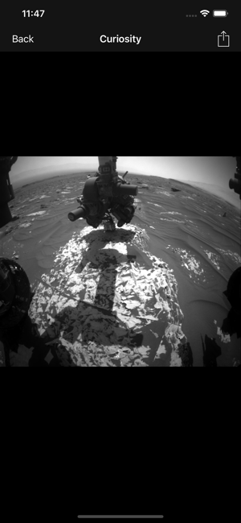
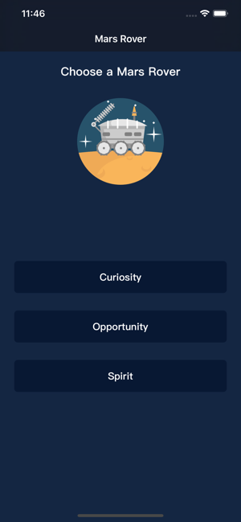
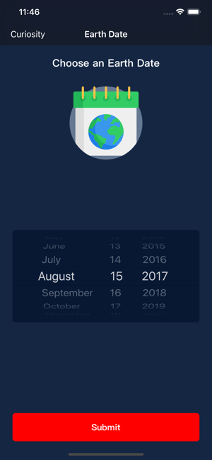
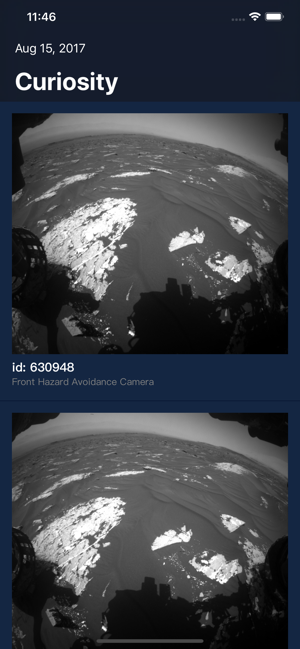
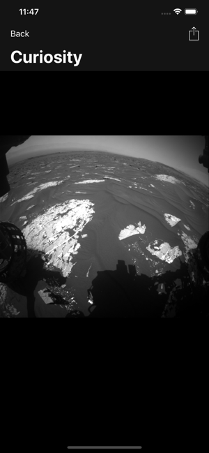

# README
## MarsCam
[MarsCam](https://apps.apple.com/us/app/marscam/id1454287204) is an iOS app shows real Mars photos taken by the three Mars rovers: Curiosity, Opportunity, Spirit.
## App icon


## Screenshoot

 

## Instructions
1. Select an earth date



2. Choose between the three Mars rovers:  Curiosity, Opportunity, Spirit.



3. Press submit button

## Built with
* [Swift](https://developer.apple.com/swift/)
* [Xcode](https://developer.apple.com/xcode/)

## Deployment
* [App Store, iOS](https://www.apple.com/ios/app-store/)

## Key features
### Image show
 

### Share image
User can share the image they found

## Technical details
### Zoom animation
#### Zoom in
```
func animateImageView(marsPhotoImageView: UIImageView) {
    self.marsPhotoImageView = marsPhotoImageView
        
    if let startingFrame = marsPhotoImageView.superview?.convert(marsPhotoImageView.frame, to: nil) {
            
        marsPhotoImageView.alpha = 0
            
        blackBackgroundView.frame = self.view.frame
        blackBackgroundView.backgroundColor = .black
        blackBackgroundView.alpha = 0
        view.addSubview(blackBackgroundView)

        zoomImageView.frame = startingFrame
        zoomImageView.isUserInteractionEnabled = true
        zoomImageView.image = marsPhotoImageView.image
        zoomImageView.contentMode = .scaleAspectFill
        zoomImageView.clipsToBounds = true

        view.addSubview(zoomImageView)

        zoomImageView.addGestureRecognizer(UITapGestureRecognizer(target: self, action: #selector(zoomOut)))

        UIView.animate(withDuration: 0.75) { () -> Void in
            let height = (self.view.frame.width / startingFrame.width) * startingFrame.height

            let y = self.view.frame.height / 2 - height / 2

            self.zoomImageView.frame = CGRect(x: 0, y: y, width: self.view.frame.width, height: height)

            self.blackBackgroundView.alpha = 1
        }
    }
    // Push In Share Button
    let shareButton = UIBarButtonItem(barButtonSystemItem: .action, target: self, action: #selector(shareButtonTapped))
    self.navigationItem.rightBarButtonItem = shareButton
    // Push In Back Button
    self.navigationItem.leftBarButtonItem = UIBarButtonItem(title: "Back", style: .plain, target: self, action:   #selector(backButtonTapped))
}
```
#### Zoom out
```
@objc func zoomOut() {
    if let startingFrame = marsPhotoImageView!.superview?.convert(marsPhotoImageView!.frame, to: nil) {
        UIView.animate(withDuration: 0.75, animations: { () -> Void in
            self.zoomImageView.frame = startingFrame
            
            self.blackBackgroundView.alpha = 0
        }, completion: { (didComplete) -> Void in
            self.zoomImageView.removeFromSuperview()
            self.blackBackgroundView.removeFromSuperview()
            self.marsPhotoImageView?.alpha = 1
        })
    }
    // Pop Out Share Button
    self.navigationItem.rightBarButtonItem = nil
    // Push In Date Back Button
    self.navigationItem.leftBarButtonItem = dateBackButton
}
```

## Author
[Han Dole Kim](https://handolekim.com)
